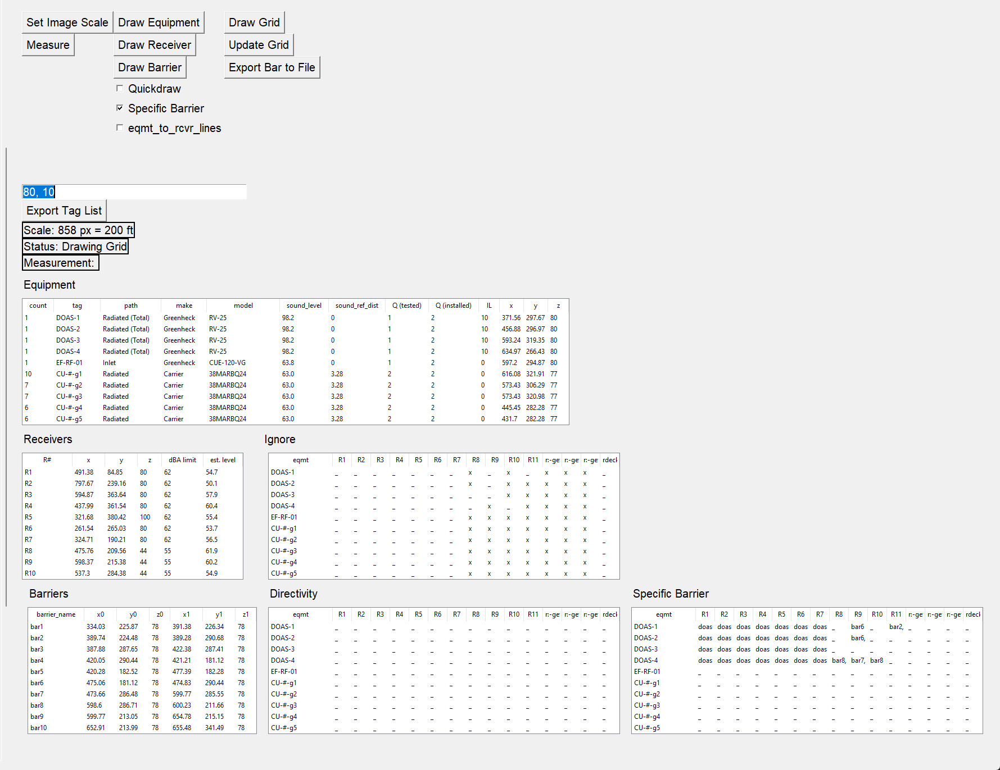
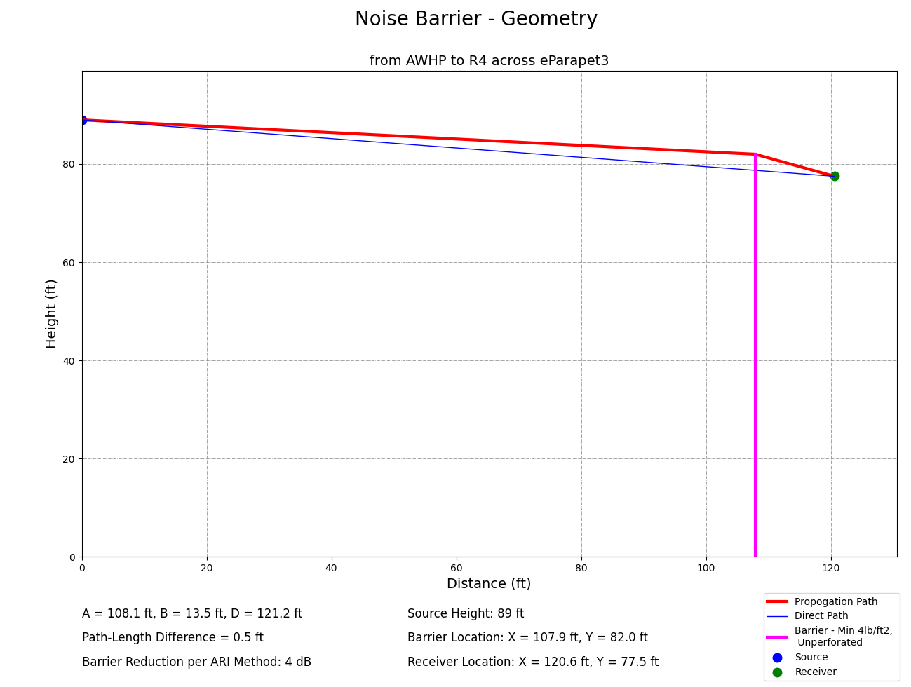

# graphical-acoustic-calcs
One of my first larger-scale projects that inspired my interest in computer science.

- This project uses Python, Tkinter, and Excel to more predict noise levels given sources, receiver, and barrier locations.
- The GUI allows the user to add and modify the locations of sources, receivers, and barriers. The predicted noise levels are displayed in tabular format within the GUI and is exportable to an excel file.
- Additionally, the source-barrier-receiver geometry and resulting insertion loss are exportable as graph for reports.

An update to this project is underway and can be found [here](https://github.com/cxhx441/acoustic_prediction_3d)

